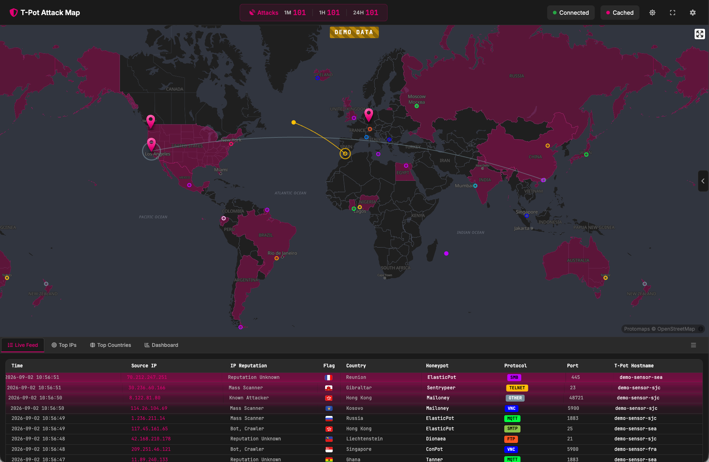

# T-Pot Attack Map

This fork of the GeoIP Attack Map was adjusted for [T-Pot](https://github.com/telekom-security/tpotce), also introducing new features (i.e. dynamic destination IPs to represent T-Pots), better performance for the Attack Map Server by using aiohttp and asyncio and, since 4.0.0, a **fully offline map stack**: no CDN, no tile service, no API key.

### T-Pot Attack Map Visualization
This geoip attack map visualizer was forked and adjusted to display T-Pot Honeypot events in real time. The data server connects to elasticsearch, parses out source IP, destination IP, source port, destination port, timestamp, honeypot type and honeypot statistics (events per last 1m, 1h, 1d). Protocols are determined via common ports, and the visualizations vary in color based on protocol type while keeping stats regarding top source IPs and countries. Since 4.0.0 an activity shading layer shades countries by observed event volume at world view and crossfades into a density heatmap (built from the same GeoIP coordinates) when zooming in — source-IP geolocation, not attribution, with city/centroid precision at best; a settings toggle turns it off.



### Map stack (4.0.0)
The map runs on [MapLibre GL JS](https://github.com/maplibre/maplibre-gl-js) with a local
[PMTiles](https://github.com/protomaps/PMTiles) vector basemap served by the app itself via
HTTP range requests — **zero third-party network requests at runtime**, enforced by a strict
same-origin CSP and verified by the browser test suite. The basemap artefact
(`static/dist/world.pmtiles`, ≈ 45 MB, world z0–6, derived from
[Protomaps](https://github.com/protomaps/basemaps) / © OpenStreetMap contributors) is never
committed: it is pinned by URL and SHA-256 in `tools/basemap.lock` and downloaded from an
immutable GitHub release by `tools/fetch_basemap.sh` (see `docs/BASEMAP.md`).

**Requirements:** a WebGL2-capable browser (MapLibre 6 removed WebGL1 support). Without WebGL2
the map area shows a clear failure notice while the dashboard, live feed and statistics keep
working — the data channel never depends on the map.

### Local development (no Elasticsearch, no Redis, no Docker)
```sh
tools/fetch_basemap.sh --preset dev        # world z0-4 extract of the pinned artefact (a few MB)
python3 AttackMapServer.py --demo          # deterministic synthetic events
# open http://127.0.0.1:64299
```
Demo flags: `--demo-seed N` (default 42), `--demo-rate R` (events/s, default 2),
`--demo-burst N`, `--demo-scenario basic|antimeridian|single-location|flood`.
The server listens on `127.0.0.1` by default (`--host`); the T-Pot container starts it
with `--host 0.0.0.0` explicitly so nginx can reach it on the docker network.
Demo mode is **CLI-only, never a default and never enabled via environment variable**; every
demo message carries `demo: true` and the UI shows a DEMO DATA badge. Never run demo mode in
production.

Full-chain test against a real Redis pubsub instead of `--demo`:
```sh
docker run --rm -p 6379:6379 redis:8.4.6-alpine
python3 AttackMapServer.py --redis-url redis://127.0.0.1:6379
python3 -m demo_events --publish-redis redis://127.0.0.1:6379 --demo-rate 5 --demo-seed 42
```

### Verification
```sh
tools/check_all.sh --bootstrap   # once per clone; the only mode that downloads tooling
tools/fetch_basemap.sh --preset dev
tools/check_all.sh               # full local suite, offline (unit, vendor, browser smoke test)
tools/check_all.sh --release     # additionally verifies the pinned full artefact
```

### Regenerating committed artefacts
| Artefact | Command |
|---|---|
| `static/styles/{dark,light}.json` | `node tools/styles/generate_styles.mjs` |
| `static/data/countries.geojson(.gz)` | `node tools/vendor_countries.mjs --rebuild` |
| `static/vendor.lock` | `tools/vendor_frontend.sh --write-lock` |
| SRI hashes in `index.html` | `python3 update_hashes.py` |
| Vendored engine/assets/licences | `tools/vendor_frontend.sh --engine --basemap-assets --licenses` |

Generated artefacts are produced under Node.js 24.20.0 LTS (`.node-version`); details in
`docs/UPDATE_HASHES_README.md`.

### Credits
The original attack map was created by [Matthew Clark May](https://github.com/MatthewClarkMay/geoip-attack-map).<br>
First T-Pot based fork was released by [Eddie4](https://github.com/eddie4/geoip-attack-map).

### Licenses / Copyright
All notices ship with the app under `static/licenses/`:
[MapLibre GL JS](https://github.com/maplibre/maplibre-gl-js/blob/main/LICENSE.txt),
[PMTiles](https://github.com/protomaps/PMTiles/blob/main/LICENSE),
[fflate](https://github.com/101arrowz/fflate/blob/master/LICENSE),
[Protomaps basemaps](https://github.com/protomaps/basemaps/blob/main/LICENSE.md) (styles) and
basemap tiles © [OpenStreetMap](https://www.openstreetmap.org/copyright) contributors (ODbL),
sprite icons derived from MIT-licensed [tangrams/icons](https://github.com/tangrams/icons),
[Noto Sans glyphs](https://github.com/protomaps/basemaps-assets) (OFL 1.1),
[Natural Earth](https://github.com/nvkelso/natural-earth-vector) (public domain, country geometry),
[Bootstrap](https://github.com/twbs/bootstrap/blob/main/LICENSE),
[Chart.js](https://github.com/chartjs/Chart.js/blob/master/LICENSE.md),
[Flagpack](https://github.com/Yummygum/flagpack-core/blob/main/LICENSE),
[Font Awesome](https://github.com/FortAwesome/Font-Awesome/blob/7.x/LICENSE.txt),
[Inter](https://github.com/rsms/inter/blob/master/LICENSE.txt),
[JetBrains Mono](https://github.com/JetBrains/JetBrainsMono/blob/master/OFL.txt).
